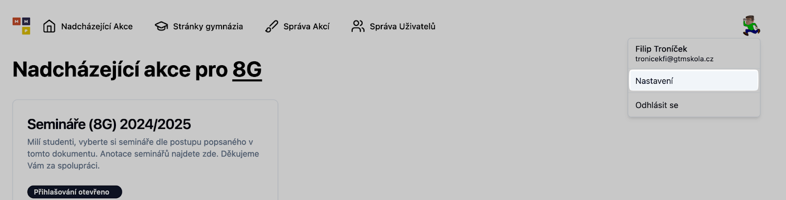

# Pro uživatele

## Přihlašování se do Aplikace

Žáci jsou hlavním publikem přihlašovacího portálu. Ze začátku jsou
uvítáni přihlašovací stránkou, která je přesměruje na přihlášení přes
jejich školní Google účet. Po úspěšném přihlášení musí uživatel zadat
jeho třídu.

V případě přihlášení pod Google účtem nepatřícím pod doménu gtmskola.cz
bude přihlášení zamítnuto a uživatel instruován k novému přihlášení s
účtem správným.

## Přihlašování se na Akce

Žáci se mohou přihlašovat pouze na Akce, které jsou označeny jako
_aktivní_. To znamená, že jejich přihlašovací okno je otevřené, a že se
akce koná v budoucnosti. Jako příklad se dají použít projektové dny, na
které se standardně přihlašuje 3 týdny před jejich konáním
a přihlašování na ně trvá jeden týden. Pro Akce, které jsou sice
v budoucnu, ale jejich přihlašování se již uskutečnilo, nabízí Aplikace
žákům přehled jimi vybraných možností, které už ale nemohou měnit.
Podobně je to u Akcí, které ještě nemají přihlašování otevřené a žáci se
mohou podívat jen na možnosti budoucího výběru.

Dalším omezením dostupnosti možnosti přihlášení na Akci je omezení tříd,
které se ke každé Akci dá nakonfigurovat. Pokud je tedy Akce omezena na
třídu A, žák ze třídy B ji neuvidí v seznamu nadcházejících Akcí. V
případě, že se žák B na stránku Akce dostane přes přímý odkaz, bude mít
přístup k zobrazení detailů (název, anotace, výpis možností apod.), ale
tlačítka pro přihlášení zůstanou skrytá.

Přihlašování probíhá přes podstránku Akce, na kterou je odkázáno ve
výpisu Akcí (úvodní stránka, na kterou je uživatel po přihlášení
přesměrován). Při vybrání aktivní Akce ze seznamu získá uživatel možnost
se přihlásit na libovolnou možnost Akce (v případě některých Akcí
kombinaci určitých možností), s výjimkou těch, které mají vyčerpanou
kapacitu (na možnosti je nastaven maximální počet účastníků a tato kvóta
je naplněna).

## Přihlašování se na semináře

Přihlašování se na semináře probíhá podobně jako na ostatní Akce, s tím,
že existují malé změny v uživatelském rozhraní a omezení výběru
možností.

Na přihlašovací stránce na semináře je pod nadpisem dynamický indikátor,
který zobrazuje, kolik týdenních hodin seminářů zbývá danému uživateli k
vybrání. Při vybrání všech požadovaných hodin indikátor zezelená a
uživatel je na semináře oficiálně zapsán (přičemž své volby může změnit
až do konce termínu přihlášek).

Na některých volbách seminářů (zejména těch pro vyšší ročníky) jsou také
omezeny kategorie (větve) seminářů, na které se uživatel může zapsat.
Například pokud se uživatel zapíše na seminář fyziky, který je
kategorizován do větve přírodovědné, nemůže se již přihlásit na seminář
literatury (na humanitní větev po zvolení předmětu z větve přírodovědné
již nepůjde kliknout). Ve většině případů je ale také volitelná větev
univerzální, která obsahuje předměty volitelné nezávisle na všech
ostatních.

## Změna třídy uživatele

Třída uživatele určuje Akce, které může uživatel zobrazit a na které se
může přihlásit. Každý uživatel si může svoji třídu změnit v uživatelském
nastavení, které je dostupné jako odkaz po kliknutí profilového obrázku
v pravém horním rohu Aplikace.

Volbu může uživatel vytvořit ze seznamu všech dostupných tříd a poté své
změny potvrdí tlačítkem "Uložit".
